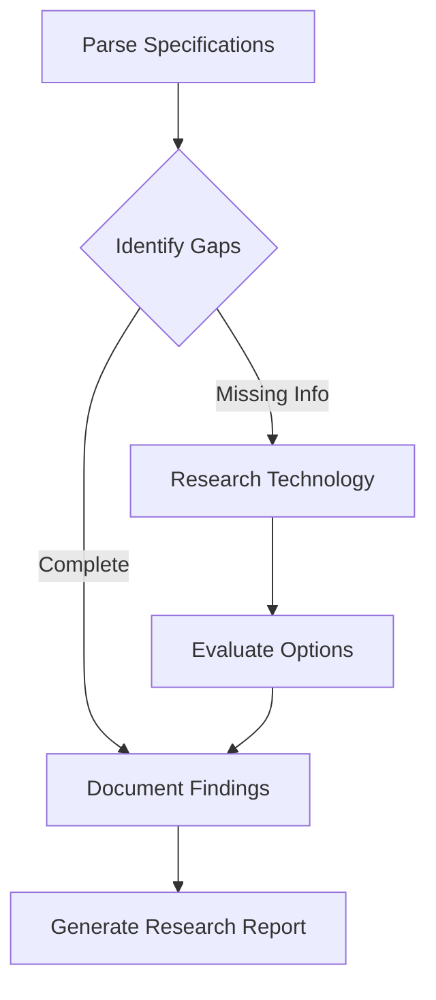
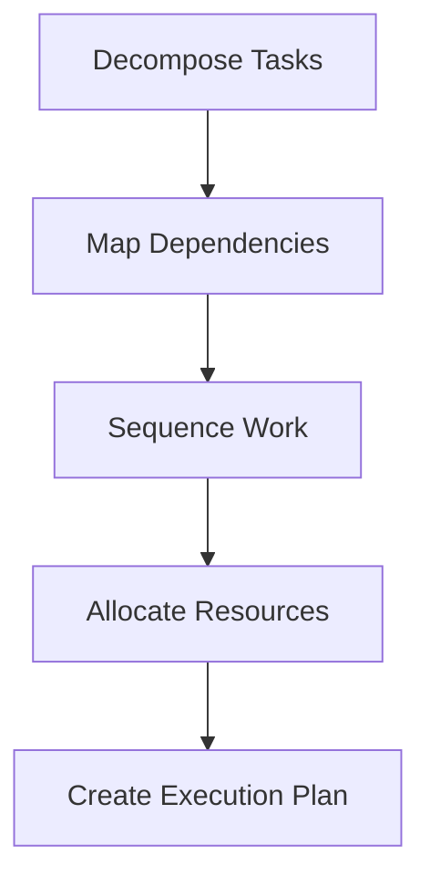
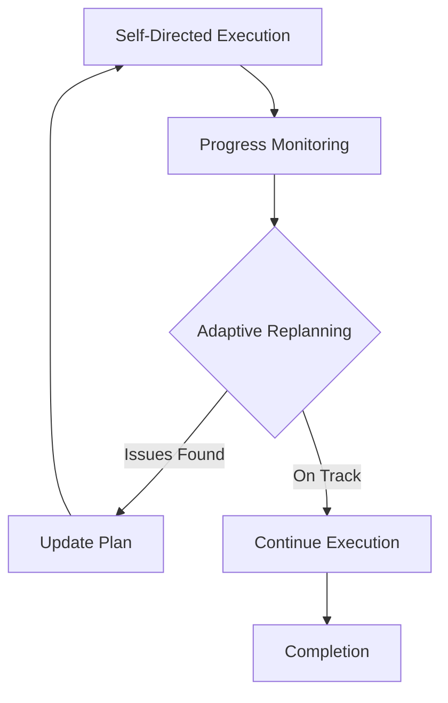
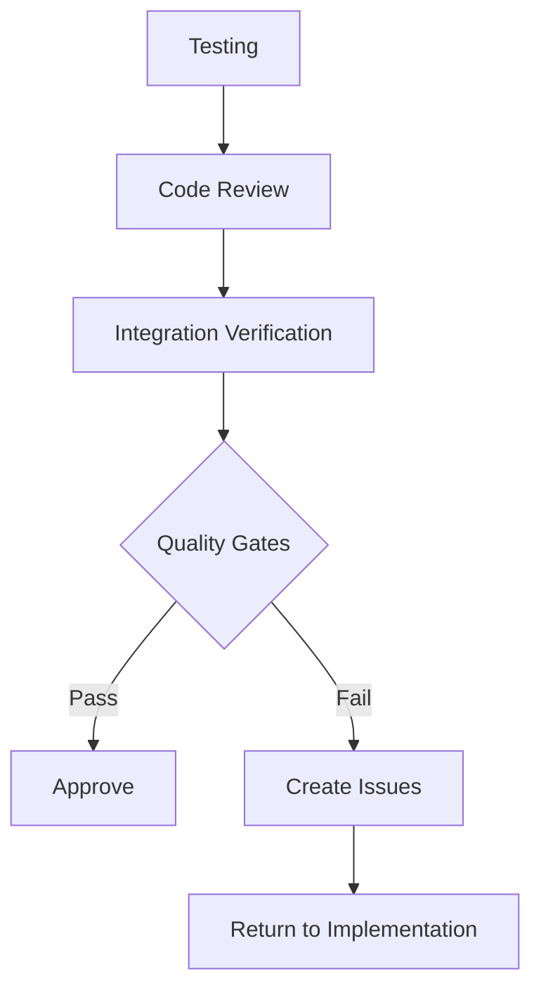

# AI Agentic Autonomous SDLC Framework

## Overview

The AI Agentic Autonomous SDLC Framework is an integrated system for Kilo Code that provides autonomous software development lifecycle management using LangGraph-based state machines. It enables AI agents to autonomously manage the entire software development process from requirements gathering through deployment, with built-in oversight, quality controls, and cost management.

---

## Key Architectural Decisions

### 1. LangGraph for SDLC Pipeline State Machines

- **Rationale**: LangGraph provides robust state machine capabilities with cycles, branching, and conditional logic essential for complex SDLC workflows
- **Implementation**: SDLC phases modeled as graph nodes with transitions based on completion criteria
- **Benefits**: 
  - Visual representation of workflow states
  - Built-in checkpointing and recovery
  - Conditional routing for adaptive workflows
  - Integration with LangChain ecosystem

### 2. Hierarchical Configuration (Default → Project → User)

```
Configuration Hierarchy:
├── Default (Framework defaults)
├── Project (.framework/config.yaml)
└── User (VS Code settings / environment variables)
```

- **Merge Strategy**: Deep merge with user settings taking precedence
- **Schema Validation**: JSON Schema validation at each level
- **Hot Reloading**: Configuration changes trigger state updates without restart

### 3. Custom Kilo Modes

| Mode | Purpose | Key Capabilities |
|------|---------|------------------|
| `requirements` | Requirements analysis and specification | Parse specs, identify gaps, document findings |
| `scanner` | Deep codebase analysis | Multi-pass analysis, anti-pattern detection |
| `review` | Code review and quality assurance | Security, performance, architecture review |
| `orchestrator` | Workflow coordination | Built-in mode for managing SDLC phases |

- **Definition Location**: `.kilo/modes/*.yaml`
- **Structure**: Role definition, available tools, custom instructions, constraints

### 4. Deep Scanner with Multiple Analysis Passes

**Pass Architecture:**
1. **Anti-Patterns Pass**: Code smell detection, complexity analysis
2. **Architecture Pass**: Dependency analysis, coupling metrics
3. **Performance Pass**: Bottleneck identification, resource usage
4. **Security Pass**: Vulnerability scanning, compliance checks

- **MCP Integration**: Scanner leverages MCP servers for external analysis tools
- **Incremental Scanning**: Only re-scans changed files
- **Report Generation**: Structured output with severity levels and recommendations

### 5. Waste Detection and Cost Oversight

**Tracking Metrics:**
- Token usage per operation
- API call costs
- Execution time
- Retry rates

**Alert Thresholds:**
- Warning at 80% of budget
- Critical at 95% of budget
- Auto-pause at 100% of budget

**Optimization Strategies:**
- Smart caching of LLM responses
- Batch processing where possible
- Early termination for low-value operations

### 6. Self-Provisioning Bootstrap System

- **Purpose**: Initialize framework on first use without manual configuration
- **Process**:
  1. Detect project type and structure
  2. Generate default configuration
  3. Create mode definitions
  4. Set up webhook endpoints
  5. Validate installation

### 7. GitHub Webhook Integration

**Supported Events:**
- `push`: Trigger analysis on code changes
- `pull_request`: Automated review and feedback
- `issues`: Requirements extraction and task creation
- `workflow_run`: CI/CD integration

**Security:**
- HMAC signature verification
- IP allowlisting
- Event payload validation

---

## Critical Execution Flows

### Research Phase



**Activities:**
1. **Parse Specs**: Extract requirements from PR descriptions, issues, or documents
2. **Identify Gaps**: Determine missing technical details or unclear requirements
3. **Research Tech**: Evaluate libraries, frameworks, and approaches
4. **Document Findings**: Create structured research output for planning phase

### Planning Phase



**Activities:**
1. **Decompose Tasks**: Break work into atomic, actionable items
2. **Map Dependencies**: Identify task prerequisites and relationships
3. **Sequence Work**: Order tasks for optimal execution
4. **Allocate Resources**: Assign modes and tools to each task

### Implementation Phase



**Activities:**
1. **Self-Directed Execution**: Agent autonomously completes assigned tasks
2. **Progress Monitoring**: Track completion status and blockers
3. **Adaptive Replanning**: Adjust plan based on discovered issues or changes

### Verification Phase



**Activities:**
1. **Testing**: Run unit, integration, and E2E tests
2. **Code Review**: Scanner and human-in-the-loop review
3. **Integration Verification**: Ensure changes integrate with existing code
4. **Quality Gates**: Automated checks for coverage, linting, security

---

## Component Mapping

### 1. Framework Config Subsystem

**Files:**
- `.framework/config.yaml` - Main configuration file
- `.framework/schema.json` - JSON Schema for validation

**Responsibilities:**
- Hierarchical config loading
- Schema validation
- Environment variable substitution
- Hot reload support

**Configuration Sections:**
```yaml
sdlc:
  phases: [research, planning, implementation, verification]
  auto_advance: true
  quality_gates:
    min_coverage: 80
    max_complexity: 10

cost:
  budget_usd: 100
  alert_threshold: 0.8
  auto_pause: true

modes:
  default: orchestrator
  available: [requirements, scanner, review]

webhooks:
  github:
    enabled: true
    events: [push, pull_request]
```

### 2. LangGraph Integration

**Components:**
- **SDLC Pipeline Graph**: Core state machine definition
- **CLI Wrapper**: Command-line interface for graph execution
- **State Management**: Checkpointing and recovery

**State Structure:**
```typescript
interface SDLCState {
  phase: 'research' | 'planning' | 'implementation' | 'verification';
  context: {
    requirements: Requirement[];
    research: ResearchFinding[];
    plan: ExecutionPlan;
    progress: ProgressUpdate[];
  };
  config: FrameworkConfig;
  metrics: {
    tokensUsed: number;
    costIncurred: number;
    timeElapsed: number;
  };
}
```

### 3. Custom Modes

**Definition Structure** (`.kilo/modes/*.yaml`):
```yaml
slug: scanner
name: Deep Scanner
roleDefinition: |
  You are a code analysis expert specializing in...

customInstructions: |
  When analyzing code:
  1. Run all analysis passes
  2. Document findings with severity
  3. Provide actionable recommendations

availableTools:
  - codebase_search
  - search_files
  - read_file
  - run_scanner_pass

restrictedTools:
  - write_to_file
  - edit_file

subtasks:
  - slug: anti_patterns
    name: Anti-Pattern Detection
  - slug: architecture
    name: Architecture Analysis
  - slug: performance
    name: Performance Review
  - slug: security
    name: Security Audit
```

### 4. Deep Scanner

**Multi-Pass Analysis Engine:**

| Pass | Purpose | Tools Used | Output |
|------|---------|------------|--------|
| Anti-Patterns | Detect code smells | AST analysis, pattern matching | Smell report |
| Architecture | Analyze structure | Dependency graphs, coupling metrics | Architecture report |
| Performance | Find bottlenecks | Profiling, complexity analysis | Performance report |
| Security | Vulnerability scan | SAST, dependency check | Security report |

**MCP Integration:**
- Uses MCP servers for external analysis tools
- Falls back to built-in analysis if MCP unavailable
- Aggregates results from multiple sources

### 5. Waste Detection

**Token Tracking:**
```typescript
interface TokenUsage {
  operation: string;
  model: string;
  inputTokens: number;
  outputTokens: number;
  costUsd: number;
  timestamp: Date;
}
```

**Alert System:**
- Real-time budget monitoring
- Configurable alert thresholds
- Automatic operation pausing
- Cost projection and forecasting

### 6. Webhooks

**GitHub Event Handlers:**

| Event | Handler | Action |
|-------|---------|--------|
| push | PushHandler | Trigger incremental analysis |
| pull_request | PRHandler | Run scanner, post review |
| issues | IssueHandler | Extract requirements, create tasks |
| workflow_run | WorkflowHandler | Update SDLC state based on CI |

**Configuration:**
```yaml
webhooks:
  github:
    secret: ${GITHUB_WEBHOOK_SECRET}
    enabled_events:
      - push
      - pull_request
    filters:
      branches: [main, develop]
      paths: ['src/**', 'packages/**']
```

### 7. Bootstrap System

**Self-Provisioning Steps:**
1. **Detect Project Type**: Analyze package.json, structure, dependencies
2. **Generate Config**: Create `.framework/config.yaml` with defaults
3. **Create Modes**: Generate mode definitions based on project type
4. **Setup Webhooks**: Configure webhook endpoints if credentials provided
5. **Validate**: Run validation to ensure setup is correct

**CLI Commands:**
```bash
kilo framework bootstrap          # Initialize framework
kilo framework bootstrap --force  # Re-initialize (overwrite)
```

---

## Implementation Targets

### Technology Stack

- **Language**: TypeScript/JavaScript (Node.js 18+)
- **State Machine**: LangGraph + LangChain
- **CLI**: Commander.js
- **Validation**: Zod + JSON Schema
- **Testing**: Vitest

### CLI Commands

| Command | Description | Options |
|---------|-------------|---------|
| `kilo framework start` | Start SDLC workflow | `--phase`, `--resume` |
| `kilo framework status` | Show current state | `--watch` |
| `kilo framework scan` | Run deep scanner | `--pass`, `--file` |
| `kilo framework bootstrap` | Initialize framework | `--force` |

### Mode Implementations

**Requirements Mode:**
- Parse natural language requirements
- Identify ambiguity and gaps
- Research technical approaches
- Generate structured specifications

**Scanner Mode:**
- Run multi-pass analysis
- Generate comprehensive reports
- Integrate with MCP servers
- Provide actionable recommendations

**Review Mode:**
- Code quality assessment
- Security vulnerability detection
- Performance analysis
- Integration verification

### Scanner Passes

1. **Anti-Patterns Pass:**
   - Code smell detection (long methods, duplicate code)
   - Complexity metrics (cyclomatic, cognitive)
   - Naming convention violations
   - Design pattern misuse

2. **Architecture Pass:**
   - Dependency analysis
   - Coupling and cohesion metrics
   - Layer violations
   - Circular dependency detection

3. **Performance Pass:**
   - Algorithmic complexity analysis
   - Resource leak detection
   - N+1 query detection
   - Memory usage patterns

4. **Security Pass:**
   - SAST (Static Application Security Testing)
   - Dependency vulnerability scanning
   - Secret detection
   - OWASP compliance checking

### Configuration-Driven Behavior

The framework is heavily configuration-driven to enable:
- **Customization**: Adapt to different project types without code changes
- **Extensibility**: Add new modes, passes, and integrations via config
- **Maintainability**: Behavior changes without deployment
- **Testing**: Different configurations for different environments

---

## Integration Points

### Kilo Code Extension

- **Mode System**: Extends existing mode infrastructure
- **Tool Integration**: Uses existing tool framework
- **Webview**: Displays SDLC progress and reports
- **Settings**: Integrates with VS Code settings

### External Systems

- **GitHub**: Webhook events, PR comments, issue tracking
- **MCP Servers**: External analysis tools and data sources
- **CI/CD**: Workflow integration for quality gates
- **Monitoring**: Cost and usage tracking

---

## Success Criteria

The framework implementation is successful when:

1. **Autonomy**: Agents can complete full SDLC cycles with minimal human intervention
2. **Quality**: Code meets defined quality gates (coverage, security, performance)
3. **Efficiency**: Cost per feature is predictable and within budget
4. **Transparency**: All decisions and actions are logged and auditable
5. **Extensibility**: New modes, passes, and integrations can be added via configuration

---

## Future Enhancements

- **Multi-Agent Coordination**: Multiple agents working on different phases
- **Learning System**: Improve recommendations based on past projects
- **Advanced Planning**: AI-driven task estimation and resource allocation
- **Integration Marketplace**: Pre-built integrations for popular tools

---

*Document Version: 1.0*
*Last Updated: 2026-02-19*
